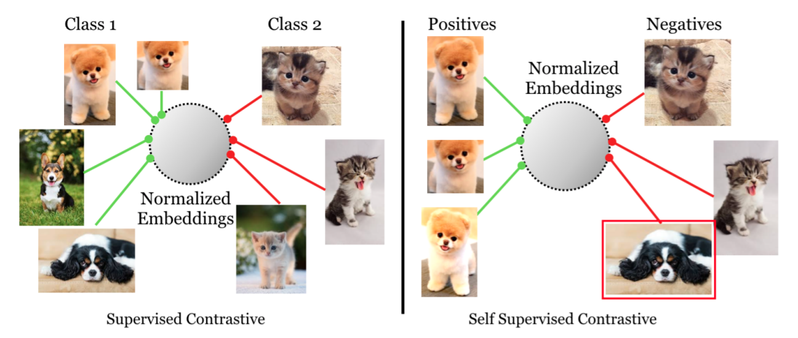
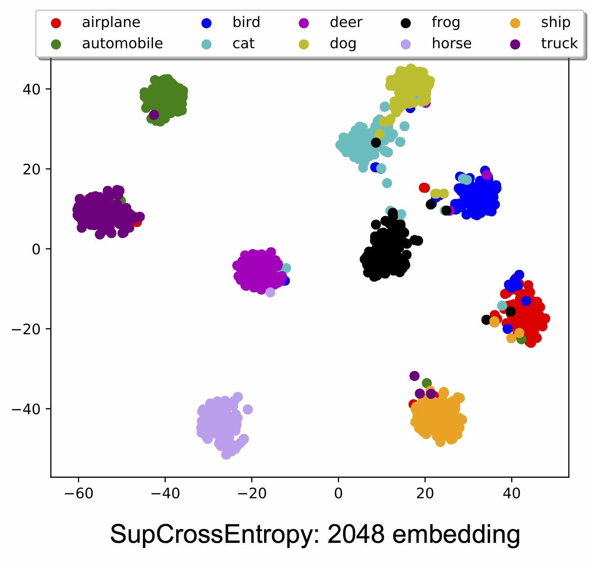
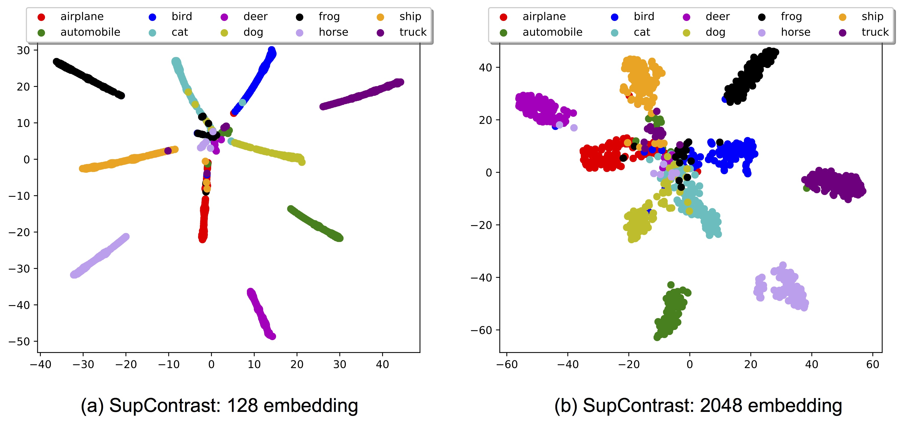
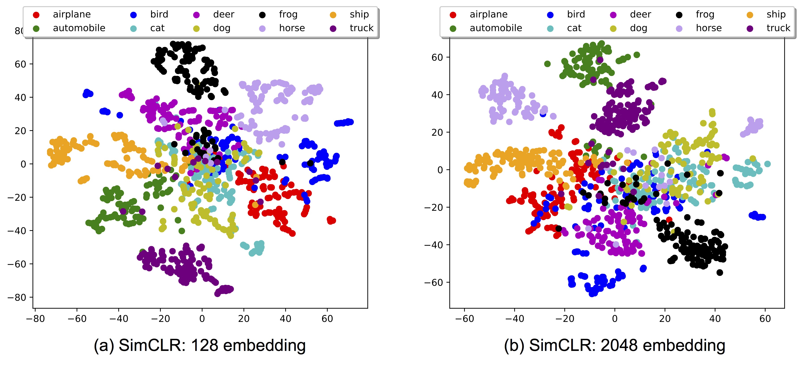

# SupContrast: Supervised Contrastive Learning
<p align="center">
  
</p>

This repo covers an reference implementation for the following papers in PyTorch, using CIFAR as an illustrative example:  
(1) Supervised Contrastive Learning. [Paper](https://arxiv.org/abs/2004.11362)  
(2) A Simple Framework for Contrastive Learning of Visual Representations. [Paper](https://arxiv.org/abs/2002.05709)  

## Update

ImageNet model (small batch size with the trick of the momentum encoder) is released [here](https://www.dropbox.com/s/l4a69ececk4spdt/supcon.pth?dl=0). It achieved > 79% top-1 accuracy.

## Loss Function
The loss function [`SupConLoss`](https://github.com/HobbitLong/SupContrast/blob/master/losses.py#L11) in `losses.py` takes `features` (L2 normalized) and `labels` as input, and return the loss. If `labels` is `None` or not passed to the it, it degenerates to SimCLR.

Usage:
```python
from losses import SupConLoss

# define loss with a temperature `temp`
criterion = SupConLoss(temperature=temp)

# features: [bsz, n_views, f_dim]
# `n_views` is the number of crops from each image
# better be L2 normalized in f_dim dimension
features = ...
# labels: [bsz]
labels = ...

# SupContrast
loss = criterion(features, labels)
# or SimCLR
loss = criterion(features)
...
```

## Comparison
Results on CIFAR-10:
|          |Arch | Setting | Loss | Accuracy(%) |
|----------|:----:|:---:|:---:|:---:|
|  SupCrossEntropy | ResNet50 | Supervised   | Cross Entropy |  95.0  |
|  SupContrast     | ResNet50 | Supervised   | Contrastive   |  96.0  | 
|  SimCLR          | ResNet50 | Unsupervised | Contrastive   |  93.6  |

Results on CIFAR-100:
|          |Arch | Setting | Loss | Accuracy(%) |
|----------|:----:|:---:|:---:|:---:|
|  SupCrossEntropy | ResNet50 | Supervised   | Cross Entropy |  75.3 |
|  SupContrast     | ResNet50 | Supervised   | Contrastive   |  76.5 | 
|  SimCLR          | ResNet50 | Unsupervised | Contrastive   |  70.7 |

Results on ImageNet (Stay tuned):
|          |Arch | Setting | Loss | Accuracy(%) |
|----------|:----:|:---:|:---:|:---:|
|  SupCrossEntropy | ResNet50 | Supervised   | Cross Entropy |  -  |
|  SupContrast     | ResNet50 | Supervised   | Contrastive   |  79.1 (MoCo trick)  | 
|  SimCLR          | ResNet50 | Unsupervised | Contrastive   |  -  |

## Running
You might use `CUDA_VISIBLE_DEVICES` to set proper number of GPUs, and/or switch to CIFAR100 by `--dataset cifar100`.  
**(1) Standard Cross-Entropy**
```
python main_ce.py --batch_size 1024 \
  --learning_rate 0.8 \
  --cosine --syncBN \
```
**(2) Supervised Contrastive Learning**  
Pretraining stage:
```
python main_supcon.py --batch_size 1024 \
  --learning_rate 0.5 \
  --temp 0.1 \
  --cosine
```

<s>You can also specify `--syncBN` but I found it not crucial for SupContrast (`syncBN` 95.9% v.s. `BN` 96.0%). </s>

WARN: Currently, `--syncBN` has no effect since the code is using `DataParallel` instead of `DistributedDataParaleel`

Linear evaluation stage:
```
python main_linear.py --batch_size 512 \
  --learning_rate 5 \
  --ckpt /path/to/model.pth
```
**(3) SimCLR**  
Pretraining stage:
```
python main_supcon.py --batch_size 1024 \
  --learning_rate 0.5 \
  --temp 0.5 \
  --cosine --syncBN \
  --method SimCLR
```
The `--method SimCLR` flag simply stops `labels` from being passed to `SupConLoss` criterion.
Linear evaluation stage:
```
python main_linear.py --batch_size 512 \
  --learning_rate 1 \
  --ckpt /path/to/model.pth
```

On custom dataset:
```
python main_supcon.py --batch_size 1024 \
  --learning_rate 0.5  \ 
  --temp 0.1 --cosine \
  --dataset path \
  --data_folder ./path \
  --mean "(0.4914, 0.4822, 0.4465)" \
  --std "(0.2675, 0.2565, 0.2761)" \
  --method SimCLR
```

The `--data_folder` must be of form ./path/label/xxx.png folowing https://pytorch.org/docs/stable/torchvision/datasets.html#torchvision.datasets.ImageFolder convension.

and 
## t-SNE Visualization

**(1) Standard Cross-Entropy**
<p align="center">
  
</p>

**(2) Supervised Contrastive Learning**
<p align="center">
  
</p>

**(3) SimCLR**
<p align="center">
  
</p>

## Reference
```
@Article{khosla2020supervised,
    title   = {Supervised Contrastive Learning},
    author  = {Prannay Khosla and Piotr Teterwak and Chen Wang and Aaron Sarna and Yonglong Tian and Phillip Isola and Aaron Maschinot and Ce Liu and Dilip Krishnan},
    journal = {arXiv preprint arXiv:2004.11362},
    year    = {2020},
}
```
